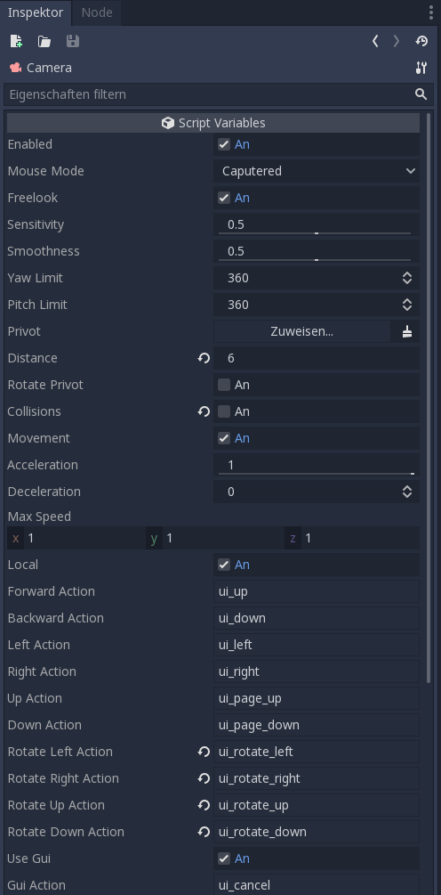
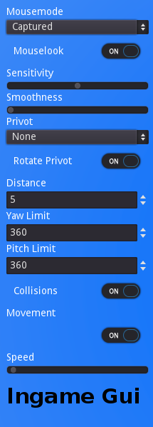

# Camera Control Script

An easy "plug and play" camera script for the godot engine 3 that provides controls like freelook(mouselook), movement and an optional ingame control gui.
Useful for development and quick tests.

### Features:
- freelook (mouse/controller/keyboard)
- movement
- controller support
- ingame gui (optional)

### Preview:
Demo video: https://www.youtube.com/watch?v=OSJRc-IiOio&t=9s

<details>
  <summary>Editor Settings</summary>
   
</details>
<details>
  <summary>Ingame Gui</summary>
	
</details>

## How to use

There is a demo scene in the demo folder where you can test all features and play with the script settings.

If you don't need the demo just ignore the demo folder and connect your camera with the "camera_control.gd" script that can be found in the script folder.

### Add events to InputMap actions

Here is an example to add WASD movements programatically, assuming the camera node name is `Camera`:

```gdscript
func setup_camera():
	set_action($Camera.forward_action, Config.key_move_forward)
	set_action($Camera.backward_action, Config.key_move_backward)
	...
	return

func set_action(action: String, config_key: String):
	var input_event := InputEventKey.new()
	input_event.scancode = OS.find_scancode_from_string(config_key)
	InputMap.action_add_event(action, input_event)
```

This logic can be used to load key bindings from a configuration file.

## Docummentation:

### Settings available via Editor/GDscript:

#### General
- bool `enable` : enable/disable camera controls. Default is true.
- int `mouse_mode`: Same as [Godot's mouse settings](https://docs.godotengine.org/en/latest/classes/class_input.html?highlight=Input#enumerations). By default, the mouse is captured:
  - `Visible` = 0 (Input.MOUSE_MODE_VISIBLE),
  - `Hidden` = 1 (Input.MOUSE_MODE_HIDDEN),
  - `Captured` = 2 (Input.MOUSE_MODE_CAPTURED),
  - `Confined` = 3 (Input.MOUSE_MODE_CONFINED).

#### Freelook
- bool `freelook` - Enable/disable freelook. Default is true.
- float `sensitivity` - Sensitivity of the freelook. A value between 0 and 1. Default value is 0.5.
- float `smoothness` - Smoothness of the freelook. A value between 0,001 and 0,999. Default value is 0.5.
- int `yaw_limit` - Limit the yaw of the mouselook in Degrees, if limit >= 360 there is no limit. Default value is 360.
- int `pitch_limit` - Limit the Pitch of the mouselook in Degrees, if limit = 360 there is no limit. Default value is 360.

#### Pivot
- Spatial `privot` - Optional privot object for thirdperson like mouselook. Default value is None (no privot).
- bool `rotate_privot` - Enable/disable if the will be rotated with the camera. Default is false.
- float `distance` - The distance between the camera and the privot object. Minimum value is 0. Default value is 5.0
- bool `rotate_privot` - Rotate privot object with the mouselook. Default is false.
- bool `collision` - The camera avoid it to go through/behind objects. Default is true.

#### Movement
- bool `movement` - Enable/disable camera movement (flying). Default is true.
- bool `local` - Switch between movement on local or global axes. Default is true.
- float `acceleration` - Set the movement speed up factor. A Value between 0 and 1. Default value is 1.0.
- float `deceleration` - Set the movement slow down factor. A Value between 0 and 1. Default value is 0.1.
- Vector3 `max_speed` - Set maximum movement speed for each axes separately. Default value is (1.0, 1.0, 1.0).

#### Input Actions / Controls
##### Freelook
- String `rotate_left_action` - Input Action for Left rotation. Default action is "".
- String `rotate_right_action` - Input Action for Right rotation. Default action is "".
- String `rotate_up_action` - Input Action for upward rotation. Default action is "".
- String `rotate_down_action` - Input Action for downward rotation. Default action is "".

##### Movement
- String `forword_action` - Input Action for fordward movement. Default action is "ui_up".
- String `backward_action` - Input Action for backward movement. Default action is "ui_down".
- String `left_action` - Input Action for Left movement. Default action is "ui_left".
- String `right_action` - Input Action for Right movement. Default action is "ui_right".
- String `up_action` - Input Action for upward movement. Default action is "ui_page_up".
- String `down_action` - Input Action for downward movement. Default action is "ui_page_down".

#### Ingame Gui
- String `gui_action` - Input Action to show/hide the ingame control gui. Default action is "ui_cancel".
- bool `use_gui` - Enable/disable ingame gui. Default is true.

### Gui configuration:

The ingame gui can also be configurated via constants in the camera_control_gui.gd script


- const Vector2 `GUI_POS` - The default position of the gui. Default is (10, 10).
- const Vector2 `GUI_SIZE` - The size of the gui. Default is (200, 0)
- const bool `DRAGGABLE` - Enable/disable draggable gui. Default is true.
- const bool `CUSTOM_BACKGROUND` - Enable/disable custom background color. Default is false.
- const Color `CUSTOM_COLOR` - Set custom background color.
- const `MAX_SPEED` - The maximal value of the speedslider

## License

MIT License - see the LICENSE.md file for details.
Please keep license file, thanks. :)
